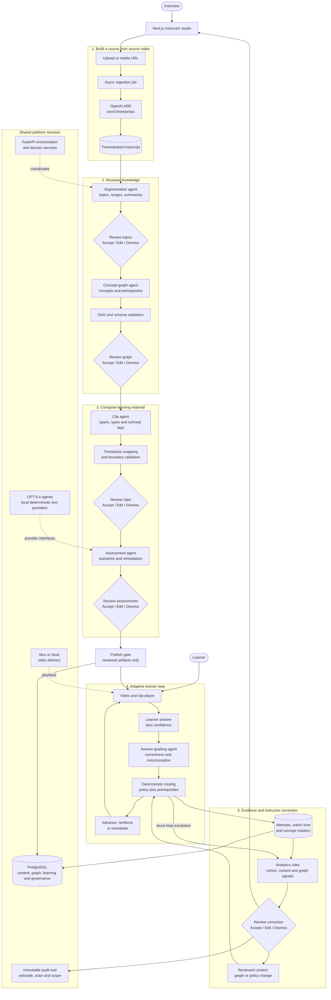

# Manifold

> **Directing AI agents to transform expertise into infinite paths to master.**

Manifold is a video-native adaptive learning platform that turns an instructor's
existing lecture recordings into a structured, mastery-based course. AI agents
propose the course outline, concept graph, reusable clips, assessments, and
remediation paths; the instructor reviews every learner-facing artifact before it
is published.

The product is designed for independent experts, tutors, corporate trainers, and
small teaching teams that want to offer personalized learning without assembling
an instructional-design, video-editing, assessment-writing, and analytics team.

## Objective

Manifold aims to let one subject-matter expert operate an adaptive course platform
that would traditionally require an institution. For a two-hour lecture, the
current product target is to move from raw video to a reviewed, publishable course
in under 60 minutes of active instructor time, excluding asynchronous processing.

The longer-term objective is not to replace the instructor. It is to multiply the
instructor's reach while preserving their expertise, judgment, and pedagogical
intent in every path a learner can take.

## The Problem

Long-form lecture video is usually passive and linear: every learner receives the
same material in the same order, regardless of prior knowledge, confidence, or
misconceptions. Turning that video into an adaptive course is expensive because it
normally requires several specialized roles:

- an instructional designer to structure topics and prerequisites;
- a video editor to extract clean, reusable explanations and examples;
- an assessment writer to create questions and remediation logic;
- an analyst or teaching team to identify where learners are struggling; and
- engineering infrastructure to deliver video, track mastery, and route learners.

Independent experts and small teams often have valuable teaching material but not
the staff or systems required to perform this work. Fully autonomous AI course
generators create a different problem: they can discard the instructor's original
material and make pedagogical decisions without accountable human review.

## The Solution

Manifold coordinates specialized AI-assisted stages around a reviewed source of
truth: the instructor's own teaching.

1. **Ingest:** upload a lecture or provide a supported media URL.
2. **Transcribe:** create a time-aligned transcript with word-level timestamps.
3. **Structure:** propose semantic topics and an editable course outline.
4. **Model:** extract concepts and propose a directed prerequisite graph.
5. **Compose:** identify independently playable definitions, examples,
   explanations, misconception corrections, and prerequisite recaps.
6. **Assess:** generate comprehension checks, confidence prompts, and remediation
   mappings.
7. **Review and publish:** require instructor approval before generated material
   can reach a learner.
8. **Adapt:** route each learner according to correctness, confidence, mastery,
   prerequisites, and instructor-configured policy.
9. **Improve:** surface cohort, content-performance, and graph-drift signals so the
   instructor can accept, edit, or dismiss proposed corrections.

## AI Proposes, the Instructor Decides

Human review is a system invariant, not an optional approval screen. Topic
boundaries, concepts, prerequisite edges, clips, questions, remediation rules, and
dashboard corrections retain their AI rationale and instructor review state.

Every learner-facing AI artifact passes through a defined checkpoint. Review
surfaces use the same interaction model:

- **Accept AI suggestion**
- **Edit manually**
- **Dismiss**

Per-learner routing is the intentional exception: it runs autonomously at
interaction time, but it can use only reviewed artifacts and instructor-controlled
routing policy. Audit records preserve what changed, who acted, why it was
suggested, and whether a dashboard action applies going forward, retroactively, or
to one learner.

## What Exists Today

The core instructor-to-learner loop is implemented:

- asynchronous video ingestion from files and supported URLs;
- OpenAI-backed transcription with large-file audio extraction and chunking;
- editable AI topic segmentation with coverage-gap detection;
- concept and prerequisite graph generation with DAG enforcement;
- concept and edge review, including duplicate-concept merging;
- transcript-aware clip extraction, boundary snapping, flagging, and re-cutting;
- assessment generation, regeneration, remediation mapping, and learner gates;
- adaptive routing based on correctness, confidence, mastery, and prerequisites;
- learner progress and concept-level mastery views;
- cohort, content-performance, stuck-loop, and graph-drift dashboard signals;
- instructor correction actions and per-learner routing overrides;
- immutable audit trails for AI proposals and instructor decisions;
- explicit draft/published course state and learner enrollment; and
- Mux production delivery behind a provider abstraction, with local video delivery
  for development and CI.

Phase 10 polish, accessibility, performance validation, and the production UI
redesign are still in progress. See [`implementation.md`](implementation.md) for
the live status rather than relying on this summary for phase completion.

## Technical Architecture



The AI pipeline is deliberately not a single autonomous course generator. Each
agent receives structured, reviewed inputs and returns schema-validated proposals
with evidence or rationale. Those proposals stop at the instructor review gate;
only accepted or edited artifacts are available to the learner and routing
engine. Adaptive routing itself is deterministic and policy-controlled, while
GPT-5.4 grades free-text learner answers before correctness enters the mastery
loop. Local deterministic agent implementations keep development and automated
tests independent of external model calls.

The application is a monorepo with a React web client, a Python processing and
application service, shared TypeScript schemas, and PostgreSQL as the durable
system of record. Long-running media work is asynchronous. Provider interfaces
isolate transcription, AI agents, graph persistence, and video delivery from their
current implementations.

### Technology Stack

| Layer | Technology | How it is used |
|---|---|---|
| Web application | Next.js 15, React 19, TypeScript | Instructor workspaces, learner experience, API proxying, and application shell |
| UI system | Tailwind CSS 4, shadcn/ui, Base UI, Lucide | Semantic design tokens, accessible primitives, review controls, and desktop/laptop layouts |
| Graph editor | React Flow (`@xyflow/react`) | Full-canvas concept and prerequisite graph editing |
| Video player | Mux Player React | Adaptive playback using persisted public playback identifiers |
| Pipeline/API | Python 3.12, FastAPI, Pydantic | Ingestion APIs, AI orchestration, validation, review services, routing, analytics, and audit APIs |
| AI reasoning | OpenAI GPT-5.4 | Topic segmentation, concept-graph proposals, clip proposals, and assessment generation |
| Transcription | OpenAI ASR behind an `ASRProvider` interface; ffmpeg preprocessing | Word-timestamp transcription, compressed audio extraction, chunking, and timestamp merging for long lectures |
| Relational storage | PostgreSQL 16, psycopg 3, psycopg pool | Courses, videos, review states, enrollments, attempts, mastery, signals, policies, and audit events |
| Graph storage | PostgreSQL adjacency tables and recursive CTEs | DAG validation, prerequisite traversal, and eligible-next-concept queries without a second datastore |
| Video delivery | Mux in production; local provider in development/CI | Direct uploads, on-demand assets, adaptive delivery, playback metadata, and capacity enforcement |
| Validation/contracts | Pydantic, Zod, shared TypeScript package | Structured AI output, API models, and cross-package health contracts |
| Local infrastructure | Docker Compose | PostgreSQL, pipeline, and web services with health checks and persistent volumes |
| Automated testing | Pytest, Vitest, Playwright, axe-core, Ruff, mypy, ESLint | Unit, integration, end-to-end, accessibility, lint, and type checks |
| Performance testing | Custom async PostgreSQL load harness and Playwright | Routing, graph, dashboard, concurrency, and external playback measurements |

### Repository Layout

```text
.
├── web/                 Next.js instructor and learner application
├── pipeline/            FastAPI service, AI/video agents, migrations, and tests
├── shared/              Shared TypeScript and Zod contracts
├── scripts/             Repository-level health and utility scripts
├── .github/workflows/   Continuous-integration configuration
├── docker-compose.yml   Local application stack
├── prd.md               Product requirements and rationale
├── plan.md              Phased implementation and test plan
└── implementation.md    Live source of truth for current implementation status
```

## Local Setup with Docker

### Prerequisites

- Docker with Docker Compose
- an OpenAI API key for the default AI and transcription providers
- optional Mux credentials when testing production-style video delivery

### Start the application

1. Copy the environment defaults on first run:

   ```bash
   cp .env.example .env
   ```

2. Add `OPENAI_API_KEY` to `.env`.

3. Start the stack:

   ```bash
   docker compose up --build
   ```

4. Open the services:

   - Web application: <http://localhost:3000>
   - Pipeline health endpoint: <http://localhost:8000/health>

PostgreSQL migrations are applied by the pipeline container at startup.

### Video provider configuration

Local delivery is the default and requires no Mux account:

```dotenv
VIDEO_PROVIDER=local
```

To use Mux on-demand delivery:

```dotenv
VIDEO_PROVIDER=mux
MUX_TOKEN_ID=your-token-id
MUX_TOKEN_SECRET=your-token-secret
MUX_MAX_STORED_VIDEOS=10
```

The configured capacity is checked before a new upload. The application does not
silently delete or overwrite an existing Mux asset when the limit is reached.

## Host Development

Docker is sufficient to run the application. Install host dependencies only when
running development tools or tests directly:

```bash
npm install
cd pipeline
uv sync --extra dev --python 3.12
cd ..
```

Useful commands:

```bash
# Run the Next.js development server through the root workspace
npm run dev --workspace @coursefoundry/web

# Run JavaScript/TypeScript linting, type checks, and unit tests
npm run ci

# Run the web production build
npm run build --workspace @coursefoundry/web

# Run the Playwright end-to-end suite
npm run test:e2e

# Run Python checks and tests
cd pipeline
uv run ruff check .
uv run mypy app
uv run pytest
```

After starting the full local stack, verify cross-service health with:

```bash
npm run test:health
```

The `@coursefoundry/*`, database, test-email, and temporary-directory names that
remain in the repository are legacy internal compatibility identifiers. The public
product name is **Manifold**. Renaming those identifiers requires a coordinated
package, database, migration, environment, and deployment change; it should not be
performed as a documentation-only replacement.

## Current Production Boundaries

Manifold is not yet represented as production-ready SaaS. In particular:

- selectable development identities are not production authentication;
- credentials, secure sessions, account recovery, and security hardening remain;
- multi-tenant organizations, subscription billing, and payments are not built;
- the public learner marketplace and discovery experience are future work;
- the current production UI redesign targets desktop and laptop web, not tablet or
  mobile layouts; and
- learner-efficiency claims require a controlled real-cohort study. Existing load
  and end-to-end tests validate engineering behavior, not learning outcomes.

These boundaries are intentional and tracked in [`prd.md`](prd.md) and
[`implementation.md`](implementation.md).

## Product and Engineering Documents

Read project documents in this order:

1. [`implementation.md`](implementation.md) — what exists now, current status, and
   confirmed architecture decisions.
2. [`plan.md`](plan.md) — phase deliverables and automated/human test gates.
3. [`prd.md`](prd.md) — product rationale, requirements, success criteria, and
   risks.

`implementation.md` is the source of truth if these documents ever disagree about
the current implementation.
