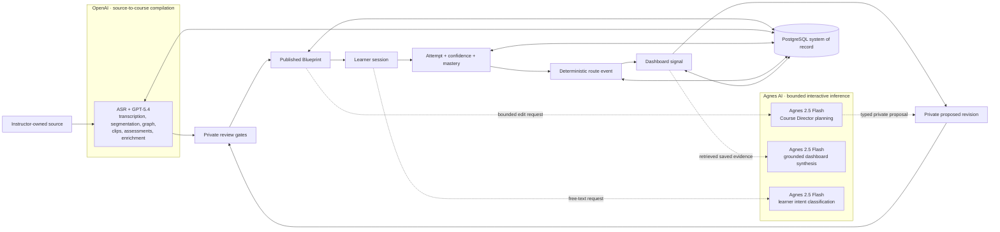

# Manifold

**A human-governed adaptive course compiler for instructor-owned teaching.**

Manifold turns a lecture recording into a reviewable adaptive course system:
topics, concepts, prerequisite relationships, reusable teaching clips,
assessments, remediation, learner routes, dashboard signals, and private course
revisions. AI prepares the system; the instructor remains the publishing
authority.

The core product claim is not “AI writes a course.” It is that one instructor can
operate a closed teaching loop without surrendering pedagogical control:

```text
source → course model → reviewed teaching → learner evidence
       → adaptive route → instructor signal → reviewed revision
```

## Live demo

Open the public deployment at
[manifold-aaryan126.onrender.com](https://manifold-aaryan126.onrender.com/login).

- Instructor: `David` / `David1`
- Learner: `Brian` / `Brian1`

These are fixed demonstration identities, not production authentication. The
demo runs on Render's free service tier with an isolated Neon database, so the
first request after an idle period can take roughly a minute while the services
wake up. The published `Learn Anything in 20 Hours` course is enrolled for the
learner account and includes the bundled lecture media.

## Submission links

- [Public repository](https://github.com/Aaryan126/Manifold-Directing-AI-agents-to-transform-expertise-into-infinite-paths-to-mastery)
- [Live application](https://manifold-aaryan126.onrender.com/login)
- [LaunchPad write-up](competition/launchpad-writeup.md)
- [Benchmark evidence](competition/metrics.md)
- Demo video: **add the final public video URL before submission**.

## Why it exists

A lecture video is normally one path for every learner. Making it adaptive
traditionally involves several separate jobs: instructional design, video
editing, assessment writing, learning analytics, and ongoing course maintenance.
Generic AI authoring can accelerate drafting, but speed alone does not answer:

- Which source moment supports this concept?
- Why did a learner receive this route?
- Which evidence produced an instructor alert?
- What course change is proposed, and who approved it?
- Will an AI-authored change reach learners before review?

Manifold makes those questions part of the product contract.

## What is working

- asynchronous lecture ingestion and timestamped transcription;
- semantic topic segmentation and editable course outlines;
- concept extraction, sparse prerequisite graphs, and direct graph editing;
- reusable clip extraction and local zero-based media materialization;
- concept-grounded assessments, confidence prompts, and remediation rules;
- deterministic prerequisite-, correctness-, confidence-, and mastery-aware routing;
- immutable route events, attempts, mastery transitions, and audit records;
- evidence-driven instructor signals and private specialist proposal packs;
- versioned active/working course revisions with atomic publication;
- a bounded learner assistant that can use only reviewed course artifacts;
- Course Director coordination with independent `Accept / Edit / Dismiss` review;
- a judge-facing **Trace decision** view that follows persisted lineage from the
  source moment through learner evidence and a proposed revision.

`implementation.md` is the live source of truth for exact phase status. Several
late phases have automated verification but still await the user's human
checklist confirmation; this README does not relabel them complete.

## The non-negotiable publication boundary

Initial generation is automatically assembled into an auditable, editable
private draft. Instructors can inspect or change any artifact, but do not need to
approve dozens of generated records. Nothing reaches learners until the
instructor explicitly publishes.

Later AI improvements proposed from learner evidence retain the consistent
**Accept AI suggestion / Edit manually / Dismiss** checkpoint. Runtime routing
may act automatically only over published artifacts and instructor-controlled
policy, and it persists its evidence and rationale.

## Measured evidence

The repository includes a reproducible competition harness. On the recorded
2026-07-28 run it:

- passed **294 reported automated tests** (196 Python, 98 web/shared);
- built and started the production containers;
- measured warm p95 of **17.55 ms** for the active Blueprint and **29.43 ms**
  for the decision trace on the local Docker environment;
- compiled one disposable transcript-backed course to the then-current
  `waiting_review` terminal state in
  **213.91 seconds**;
- generated **5 topics, 4 concepts, 5 clips, and 5 questions**;
- captured **17 GPT-5.4 calls**, 44,163 input tokens, 16,896 cached input tokens,
  and 8,183 output tokens, including a failed/retried attempt;
- calculated **$0.1951 USD** in token cost using current official GPT-5.4 pricing;
- recovered from one persisted clip-boundary validation failure on the second
  durable attempt;
  and
- deleted the disposable benchmark course afterward.

That recorded evaluation predates the automatic private-draft finalization
change; a new run now terminates at `complete / draft_ready`. Read the generated
[metrics report](competition/metrics.md) and
[machine-readable evidence](competition/metrics.json). These figures measure
asynchronous compilation wall time and model cost, not active instructor review
time or learner outcomes.

Run the same evaluation:

```bash
npm run eval:launchpad
```

Run a disposable real-provider compilation as well:

```bash
npm run eval:launchpad:generation
```

The evaluator keeps measured values, calculated costs, vendor claims, and
unmeasured gaps separate. It does not substitute a generic industry ratio for a
matched manual-authoring study.

### Business 101 recording rehearsal

[`competition-demo.yaml`](competition-demo.yaml) enables a deterministic replay
for the exact local Business 101 course. Uploading the prepared lecture still
creates a real source record, advances through the normal six durable progress
steps, opens the cached result as a private working Blueprint, and requires the
instructor to publish. It does not call ASR or the LLM again. Set `enabled:
false` and rebuild the pipeline container to restore real generation; every
other course always uses real generation.

Before each recording take:

```bash
pipeline/.venv/bin/python scripts/reset_business_101_generation_demo.py --apply
```

Without `--apply`, the command only reports readiness. The reset is narrowly
scoped to the exact IDs in the YAML and returns Business 101 to its one-lecture
published baseline.

## Judge-facing materials

- [LaunchPad five-pillar write-up](competition/launchpad-writeup.md)
- [Three-minute demo outline](competition/demo-outline.md)
- [Clean competition course/reset plan](competition/clean-course-plan.md)
- [Measured evaluation report](competition/metrics.md)
- [Product requirements](prd.md)
- [Phased implementation plan](plan.md)
- [Live implementation status](implementation.md)

## Repository review guide

If you are reviewing the full repository, these paths provide the shortest route
through the implementation and the evidence behind our claims:

- [`competition/metrics.md`](competition/metrics.md) and
  [`competition/metrics.json`](competition/metrics.json) — benchmark method,
  recorded timings, provider-reported token usage, calculated cost, retry
  evidence, and machine-readable results.
- [`scripts/launchpad_evaluation.py`](scripts/launchpad_evaluation.py) — the
  competition evaluation harness, including disposable real-provider generation
  and cleanup.
- [`pipeline/app/course_os/worker.py`](pipeline/app/course_os/worker.py) — the
  durable lecture-to-course pipeline, persisted stages, leases, retries,
  validation, and usage telemetry.
- [`pipeline/app/ai/agnes.py`](pipeline/app/ai/agnes.py) — the Agnes provider
  adapter, closed-schema response repair, retry policy, and telemetry.
- [`pipeline/app/course_os/course_director.py`](pipeline/app/course_os/course_director.py),
  [`pipeline/app/course_os/dashboard_assistant.py`](pipeline/app/course_os/dashboard_assistant.py),
  and [`pipeline/app/learning/guide.py`](pipeline/app/learning/guide.py) — bounded
  instructor editing, grounded dashboard synthesis, and allowlisted learner
  intent classification.
- [`pipeline/app/routing/service.py`](pipeline/app/routing/service.py) and
  [`pipeline/app/routing/policy.py`](pipeline/app/routing/policy.py) — deterministic
  evidence-aware routing and immutable route records.
- [`pipeline/app/course_os/postgres_repository.py`](pipeline/app/course_os/postgres_repository.py)
  — revisions, audits, publication boundaries, and the persisted eight-stage
  decision trace.
- [`web/app/app/courses/[courseId]/course-studio.tsx`](web/app/app/courses/%5BcourseId%5D/course-studio.tsx)
  — the instructor Blueprint, Course Director review and undo, and `Trace
  decision` UI.
- [`pipeline/tests/test_agnes_provider.py`](pipeline/tests/test_agnes_provider.py),
  [`pipeline/tests/test_agnes_agents.py`](pipeline/tests/test_agnes_agents.py),
  [`pipeline/tests/test_routing_service.py`](pipeline/tests/test_routing_service.py),
  and [`web/e2e/blueprint-learner.spec.ts`](web/e2e/blueprint-learner.spec.ts) —
  representative tests for provider safety, agent boundaries, routing, and the
  instructor-to-learner workflow.

## Architecture


```mermaid
flowchart LR
    subgraph OpenAI["OpenAI · source-to-course compilation"]
        OAI["ASR + GPT-5.4<br/>transcription, segmentation, graph,<br/>clips, assessments, enrichment"]
    end

    subgraph Agnes["Agnes AI · bounded interactive inference"]
        CD["Agnes 2.5 Flash<br/>Course Director planning"]
        DA["Agnes 2.5 Flash<br/>grounded dashboard synthesis"]
        LI["Agnes 2.5 Flash<br/>learner intent classification"]
    end

    S["Instructor-owned source"] --> OAI
    OAI --> R["Private review gates"]
    R --> B["Published Blueprint"]
    B --> L["Learner session"]
    L --> E["Attempt + confidence + mastery"]
    E --> T["Deterministic route event"]
    T --> D["Dashboard signal"]
    D --> P["Private proposed revision"]
    P --> R

    B -. "bounded edit request" .-> CD
    CD -. "typed private proposal" .-> P
    D -. "retrieved saved evidence" .-> DA
    L -. "free-text request" .-> LI

    B <--> DB[("PostgreSQL system of record")]
    OAI <--> DB
    E <--> DB
    T <--> DB
    D <--> DB
```

| Layer | Current implementation |
|---|---|
| Web | Next.js 15, React 19, TypeScript, React Flow, ELK, Motion |
| API and orchestration | Python 3.12, FastAPI, Pydantic |
| Durable work | PostgreSQL-backed task queue with leases, retries, and recovery |
| OpenAI AI | GPT-5.4 for source-to-course compilation, graph/content generation, and document enrichment |
| Agnes AI | Verified Agnes 2.5 Flash for Course Director planning, grounded dashboard synthesis, and bounded learner-intent classification |
| Deterministic safeguards | Pydantic validation, evidence-ID filtering, prerequisite/routing/grading policy, private proposal review, and atomic publication |
| Transcription | OpenAI ASR adapter with ffmpeg extraction/chunking |
| Data and graph | PostgreSQL 16 adjacency tables, recursive CTEs, revisioned artifacts |
| Video | Mux adapter plus local development/CI provider |
| Verification | Pytest, Vitest, Playwright, axe, Ruff, mypy, ESLint, TypeScript |

The Agnes integration follows the official
[model catalog and OpenAI-compatible endpoint guidance](https://github.com/AgnesAI-Labs/AgnesAI-Models/blob/main/MODEL_CATALOG.md).

Generation task outputs persist wall time and provider-returned usage. The
competition harness uses those records to calculate cost rather than estimating
tokens from prompts.

## Local setup

Prerequisites:

- Docker with Docker Compose;
- Node.js 22+ and Python 3.12+ for host-side checks;
- an OpenAI API key for real AI generation;
- an Agnes API key for the three interactive Agnes agents;
- optional Mux credentials for production-style video delivery.

Create local configuration:

```bash
cp .env.example .env
```

Set `OPENAI_API_KEY` and `AGNES_API_KEY` in `.env`. To enable the verified
hybrid routing, set:

```env
COURSE_DIRECTOR_PROVIDER=agnes
DASHBOARD_ASSISTANT_PROVIDER=agnes
LEARNING_GUIDE_PROVIDER=agnes
AGNES_AGENT_MODEL=agnes-2.5-flash
AGNES_FAST_MODEL=agnes-2.5-flash
```

Then start:

```bash
docker compose up --build
```

Open:

- app: <http://localhost:3000/login>
- API health: <http://localhost:8000/health>
- web health: <http://localhost:3000/api/health>

Migrations apply at pipeline startup. Local development uses persisted
instructor/learner identities and an `X-User-ID` context; this is deliberately
not represented as production authentication.

## Verification

```bash
npm run lint
npm run typecheck
npm test
(cd pipeline && uv run pytest -q)
npm run test:agnes:contracts
npm run test:agnes:live
npm run test:e2e
```

Human quality checks remain essential for pedagogical correctness, clip
boundaries, graph usefulness, assessment quality, and review time. Phase
completion requires the automated suite and the corresponding user-confirmed
checklist in `plan.md`.

## Honest current limits

- Active instructor review time is not instrumented yet, so the under-60-minute
  product target is not claimed as achieved.
- Current learner evidence is explicitly labelled simulation data, not a real
  outcome study. The judge-facing trace now exposes all eight persisted stages,
  including the signal-linked private proposed revision.
- The YAML-gated Business 101 recording rehearsal uses cached generated artifacts
  for one exact course and recording. It still creates a real source, advances
  durable progress, opens a private working revision, and requires explicit
  publication. Disable [`competition-demo.yaml`](competition-demo.yaml) for real
  provider generation; other courses are unaffected.
- Real AI workflows depend on OpenAI and Agnes. The public deployment additionally
  depends on Render and Neon; Mux is optional because local video delivery is
  implemented.
- Production authentication, multi-tenancy, billing, and enterprise operations
  are out of scope for the current system.
- A timed matched instructor study, concurrent Agnes availability study, and
  controlled learner-outcome study remain incomplete.

That honesty is intentional: Manifold is designed to make uncertainty,
provenance, review state, and missing evidence visible rather than laundering
them into an autonomous-AI story.

### Secrets and personal data

`.env` and `.env.*` are gitignored, while `.env.example` contains placeholders
only. Do not commit provider keys, database credentials, recordings containing
personal data, or real user information. The documented `David` and `Brian`
credentials are deliberately public synthetic demo identities, not real
accounts.
