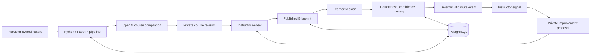

# Manifold

**Turn an instructor's lecture recordings into adaptive, mastery-based courses—without giving up control of what learners see.**

Manifold is a human-governed course compiler. It uses AI to turn a lecture into a
private, editable course draft containing topics, concepts, prerequisite links,
teaching clips, assessments, remediation rules, and learner routes. The
instructor reviews that system and is the only person who can publish it.

> AI prepares the course. The instructor directs it. Learner evidence improves it.

## At a glance

| | Manifold |
|---|---|
| **Input** | An instructor-owned lecture recording or media URL |
| **Output** | A structured adaptive course, ready for instructor review |
| **Instructor experience** | Edit the course Blueprint, publish revisions, and act on learner evidence |
| **Learner experience** | Follow a route that adapts to prerequisites, answer correctness, confidence, and mastery |
| **Safety boundary** | AI-generated work stays private until the instructor explicitly publishes it |

## What outcome is Manifold aiming for?

Manifold aims to let one expert operate a teaching loop that would normally
require instructional design, video editing, assessment, and analytics support:

- turn existing expertise into a reusable course instead of starting from a
  blank authoring tool;
- give different learners different paths through the same instructor-approved
  material;
- help learners spend time on missing prerequisites and uncertain concepts
  instead of replaying an entire lecture;
- show instructors where learners are struggling and prepare targeted course
  improvements for review;
- keep every published artifact, route decision, and proposed revision
  traceable to its source and evidence.

The long-term outcome is a closed improvement loop:

```text
lecture → private course draft → instructor review → published course
   ↑                                                ↓
reviewed improvement ← instructor signal ← learner evidence and routing
```

This repository demonstrates the system and its safeguards. It does **not** yet
claim proven improvements in learner outcomes or instructor authoring time; those
require controlled studies with real instructors and learners.

## Try the hosted demo

Open [the live Manifold demo](https://manifold-aaryan126.onrender.com/login) and
sign in with either role:

| Role | Username | Password |
|---|---|---|
| Instructor | `David` | `David1` |
| Learner | `Brian` | `Brian1` |

The learner account is already enrolled in the published **Learn Anything in 20
Hours** course. The deployment uses Render's free tier, so the first request
after a period of inactivity may take about a minute.

These are public demonstration identities—not production authentication.

## Run it locally

### Prerequisites

- [Docker](https://docs.docker.com/get-docker/) with Docker Compose
- an OpenAI API key for transcription and real course generation
- Git

Node.js 22+ and Python 3.12+ are only required if you want to run checks directly
on the host. Agnes and Mux credentials are optional.

### 1. Clone and configure

```bash
git clone https://github.com/Aaryan126/Manifold-Directing-AI-agents-to-transform-expertise-into-infinite-paths-to-mastery.git
cd Manifold-Directing-AI-agents-to-transform-expertise-into-infinite-paths-to-mastery
cp .env.example .env
```

Open `.env` and set:

```env
OPENAI_API_KEY=your_openai_api_key
```

The remaining defaults are ready for local Docker development: PostgreSQL runs
in a container and video clips are stored in a Docker volume.

### 2. Start the stack

```bash
docker compose up --build
```

The first build downloads the images and installs dependencies, so it will take
longer than later starts. Database migrations run automatically when the
pipeline starts.

### 3. Open and verify

- App: <http://localhost:3000>
- API health: <http://localhost:8000/health>
- Web health: <http://localhost:3000/api/health>

In another terminal, you can verify both services without installing project
dependencies on the host:

```bash
curl http://localhost:8000/health
curl http://localhost:3000/api/health
```

Use the same development credentials as the hosted demo:

- Instructor: `David` / `David1`
- Learner: `Brian` / `Brian1`

On a fresh database there is no completed course yet. Follow the workflow below
as the instructor, then open the learner account after publishing.

### 4. Create your first adaptive course

1. Sign in as **David** and choose **New course**.
2. Give the course a title, open its Course Flow, and choose **New lecture**.
3. Upload an audio/video lecture or provide a media URL.
4. Wait while the durable pipeline transcribes and builds the private draft.
   You can leave the page and return later.
5. Review the generated Blueprint: topics, concept graph, clips, questions,
   remediation, and routing policy.
6. Edit anything that needs instructor judgment, preview it, and choose
   **Publish course**.
7. Sign out, sign in as **Brian**, enroll in the published course, and start a
   learning session.

As Brian answers questions and records confidence, Manifold persists the
evidence and chooses the next reviewed step. Return as David to inspect the
resulting dashboard signals and private improvement proposals.

### Stop or reset

Stop the containers while keeping local data:

```bash
docker compose down
```

To start again:

```bash
docker compose up
```

To completely reset the local database and stored video, remove the Docker
volumes as well. **This permanently deletes local Manifold data:**

```bash
docker compose down -v
```

## How it works

### Course compilation

The pipeline performs six durable stages:

1. transcribe the lecture with timestamps;
2. segment it into semantic topics;
3. extract concepts and prerequisite relationships;
4. select and materialize reusable teaching clips;
5. generate concept-grounded assessments and remediation;
6. assemble routing defaults and finalize an editable private revision.

Each stage is persisted in PostgreSQL with retry and recovery state. A browser
does not need to remain open while generation runs.

### Instructor control

Initial generation becomes a coherent private draft automatically, avoiding a
clerical approval step for every generated record. The instructor can edit any
artifact, but learners see nothing until explicit publication.

Later AI-authored improvements based on learner evidence use the same visible
checkpoint: **Accept AI suggestion / Edit manually / Dismiss**. Runtime routing
can act automatically only over published artifacts and instructor-controlled
policy.

### Adaptive learning

For each learner, Manifold combines published prerequisites with saved evidence:
answer correctness, confidence, mastery state, and prior route events. The next
step is selected by deterministic policy—for example, advance after a confident
correct answer or revisit a prerequisite after an incorrect answer. Every route
event stores its evidence and rationale.

### Evidence-driven improvement

Saved learner activity produces instructor-facing signals such as a struggling
cohort or an underperforming question. Manifold can prepare a private targeted
revision from that evidence, but it cannot publish the change by itself. The
**Trace decision** view follows the lineage from source material through learner
evidence to the proposed revision.

## Architecture


```mermaid
flowchart LR
    S[Instructor-owned lecture] --> P[Python / FastAPI pipeline]
    P --> AI[OpenAI course compilation]
    AI --> D[Private course revision]
    D --> R[Instructor review]
    R --> B[Published Blueprint]
    B --> L[Learner session]
    L --> E[Correctness, confidence, mastery]
    E --> T[Deterministic route event]
    T --> G[Instructor signal]
    G --> Q[Private improvement proposal]
    Q --> R
    P <--> DB[(PostgreSQL)]
    B <--> DB
    E <--> DB
```

| Layer | Implementation |
|---|---|
| Web application | Next.js 15, React 19, TypeScript, React Flow, ELK, Motion |
| API and orchestration | Python 3.12, FastAPI, Pydantic |
| Durable work | PostgreSQL-backed task queue with leases, retries, and recovery |
| Course compilation | OpenAI ASR and GPT-5.4 |
| Optional interactive agents | Agnes 2.5 Flash for Course Director, dashboard synthesis, and learner-intent classification |
| Video | Local ffmpeg-based delivery by default; optional Mux adapter |
| Safeguards | Schema validation, evidence filtering, deterministic routing and grading, private revision review, atomic publication |
| Verification | Pytest, Vitest, Playwright, axe, Ruff, mypy, ESLint, TypeScript |

## Optional integrations

### Agnes interactive agents

OpenAI remains the default and Agnes is not required to run Manifold. The codebase
also contains an Agnes adapter for the three bounded interactive agents. Its
deployment configuration is documented in `.env.example`:

```env
AGNES_API_KEY=your_agnes_api_key
COURSE_DIRECTOR_PROVIDER=agnes
DASHBOARD_ASSISTANT_PROVIDER=agnes
LEARNING_GUIDE_PROVIDER=agnes
AGNES_AGENT_MODEL=agnes-2.5-flash
AGNES_FAST_MODEL=agnes-2.5-flash
```

With the host development dependencies installed, verify its contracts or make
a live provider call with:

```bash
npm run test:agnes:contracts
npm run test:agnes:live
```

### Mux video delivery

Local video delivery works without additional credentials. For
production-style Mux delivery, set `VIDEO_PROVIDER=mux`, `MUX_TOKEN_ID`, and
`MUX_TOKEN_SECRET` in `.env`, then rebuild.

## Development and verification

Install host dependencies only if you want to run the checks outside Docker:

```bash
npm install
python3 -m pip install uv
(cd pipeline && uv sync --extra dev)
```

Run the standard checks:

```bash
npm run lint
npm run typecheck
npm test
(cd pipeline && uv run pytest -q)
npm run test:e2e
```

Keep the Docker stack running for the health and end-to-end checks. You can also
run `npm run test:health` when Node.js is installed on the host.

Provider-specific checks:

```bash
npm run test:agnes:contracts
npm run test:agnes:live
```

Human review is still required for pedagogical correctness, useful prerequisite
relationships, clip boundaries, assessment quality, and publication decisions.

## Repository map

```text
web/                 Next.js instructor and learner interfaces
pipeline/app/        FastAPI API, AI adapters, workers, routing, and persistence
pipeline/migrations/ PostgreSQL schema migrations
pipeline/tests/      Backend tests
shared/              Shared TypeScript workspace
scripts/             Health, evaluation, demo, and reset utilities
competition/         Submission write-up, demo outline, and measured evidence
```

For deeper implementation context:

- [`prd.md`](prd.md) — product requirements and intended behavior
- [`implementation.md`](implementation.md) — live implementation status
- [`plan.md`](plan.md) — phased plan and human verification checklists
- [`competition/metrics.md`](competition/metrics.md) — benchmark method and results
- [`scripts/launchpad_evaluation.py`](scripts/launchpad_evaluation.py) — reproducible evaluation harness
- [`pipeline/app/course_os/worker.py`](pipeline/app/course_os/worker.py) — durable lecture-to-course pipeline
- [`pipeline/app/routing/policy.py`](pipeline/app/routing/policy.py) — deterministic routing policy
- [`pipeline/app/course_os/postgres_repository.py`](pipeline/app/course_os/postgres_repository.py) — revisions, publication, audit records, and decision trace

## Measured evidence

The recorded 2026-07-28 evaluation passed 294 automated tests, built and started
the production containers, and compiled one disposable transcript-backed course
in 213.91 seconds. That run produced 5 topics, 4 concepts, 5 clips, and 5
questions at a calculated model cost of $0.1951. It also exercised persisted
retry recovery and deleted the disposable course afterward.

Those measurements describe system behavior and model cost—not active instructor
review time or learner outcomes. See the full [metrics report](competition/metrics.md)
and [machine-readable results](competition/metrics.json).

Re-run the application benchmark:

```bash
npm run eval:launchpad
```

Include a disposable real-provider course compilation:

```bash
npm run eval:launchpad:generation
```

## Current limits

- Development login is deliberately not production authentication.
- Multi-tenancy, account administration, billing, and enterprise operations are
  outside the current scope.
- Real generation depends on OpenAI; Agnes, Render, Neon, and Mux are optional
  deployment/provider integrations.
- The bundled Business 101 competition rehearsal is a narrowly scoped cached
  replay for recording the prepared demo. Disable it in
  [`competition-demo.yaml`](competition-demo.yaml) to force real generation for
  that course. Other courses always use the real pipeline.
- A timed matched authoring study, concurrent provider-availability study, and
  controlled learner-outcome study are still pending.

## Competition materials

- [LaunchPad write-up](competition/launchpad-writeup.md)
- [Three-minute demo outline](competition/demo-outline.md)
- [Clean course/reset plan](competition/clean-course-plan.md)
- [Measured evaluation report](competition/metrics.md)
- Demo video: **add the final public video URL before submission**

## Security and data

`.env` files are gitignored and `.env.example` contains placeholders only. Do
not commit provider keys, database credentials, recordings containing personal
data, or real user information. The documented David and Brian accounts are
synthetic public demo identities.
